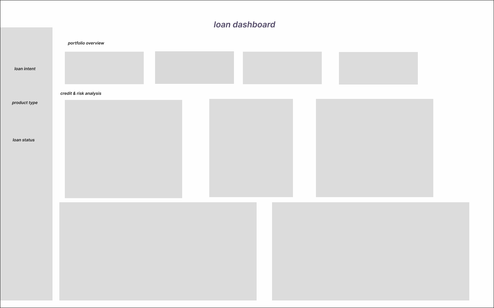

# Loan Performance Dashboard

## Project Overview

This project analyzes a realistic loan approval dataset to evaluate portfolio performance, approval behavior, and credit risk exposure.

The objective was to build a structured, decision-oriented dashboard that enables dynamic exploration rather than presenting static descriptive metrics.

The dashboard answers key analytical questions:

* What drives loan approval?
* Where is portfolio risk concentrated?
* How do income and credit factors influence loan size?

---

##  Data Source

Dataset sourced from Kaggle:
[https://www.kaggle.com/datasets/parthpatel2130/realistic-loan-approval-dataset-us-and-canada](https://www.kaggle.com/datasets/parthpatel2130/realistic-loan-approval-dataset-us-and-canada)

The dataset includes:

* Customer demographics
* Credit attributes
* Loan characteristics
* Approval outcomes

For development efficiency, a reduced dataset sample was used.
The analytical logic remains consistent with the full dataset.

---

##  Methodology

### Data Preparation

* Converted numeric text fields into proper numeric types
* Cleaned and standardized categorical values
* Built calculated fields to enhance analytical depth

---

## 📊 Key Calculations

### Approval Rate

```DAX
Approval Rate = 
VAR ApprovedCount =
    CALCULATE(
        COUNTROWS('Table1'),
        'Table1'[Loan Status Text] = "Approved"
    )

VAR TotalCount =
    COUNTROWS('Table1')

RETURN
IF(
    TotalCount = 0,
    BLANK(),
    DIVIDE(ApprovedCount, TotalCount)
)
```

---

### Risk Classification Logic

Clients are classified as higher risk if:

* Credit Score < 600
* Debt-to-Income Ratio > 40%
* Previous Defaults exist

```DAX
Risk Flag =
IF(
    VALUE(Table1[credit_score]) < 600
    || VALUE(Table1[debt_to_income_ratio]) > 0.4
    || VALUE(Table1[defaults_on_file]) > 0,
    1,
    0
)
```

---

### Portfolio Risk Exposure %

```DAX
Portfolio Risk Exposure % =
DIVIDE(
    CALCULATE(COUNTROWS(Table1), Table1[Risk Flag] = 1),
    COUNTROWS(Table1)
)
```

The 600 credit score threshold was identified after testing approval behavior across credit score bands.

---

## 🏗 Dashboard Design Structure

The dashboard follows a clear analytical hierarchy:

1. **Primary KPIs**

   * Total Applications
   * Approval Rate
   * Average Loan Amount
   * Portfolio Risk Exposure

2. **Credit & Risk Analysis**

   * Approval Rate by Credit Score
   * Risk Distribution

3. **Customer Insights**

   * Loan Size by Income Level
   * Credit Score vs Loan Amount

4. **Portfolio Composition**

   * Loan Demand by Purpose

Interactive filters allow dynamic exploration across segments.

---

## 🔍 Key Insights

* Approval rates increase sharply beyond credit score 600.
* A measurable portion of the portfolio falls under elevated risk criteria.
* Higher income segments consistently receive larger loan amounts.
* Risk concentration is strongest among low credit score and high DTI profiles.

---

## 📈 Strategic Recommendations

* Focus lending on applicants with credit score ≥ 600 to improve portfolio stability.
* Apply stricter evaluation or adjusted pricing for applicants with DTI > 40%.
* Continuously monitor portfolio risk concentration to prevent overexposure.

---

## ⚠ Assumptions & Limitations

* Risk thresholds are derived from observed dataset behavior.
* No longitudinal repayment history is available.
* A reduced dataset sample was used for performance efficiency.

---

## 🌐 Live Interactive Dashboard

Tableau Public (Live & Interactive):
[https://public.tableau.com/views/loandashboardfinal/Template?:language=en-US&publish=yes&:sid=&:redirect=auth&:display_count=n&:origin=viz_share_link](https://public.tableau.com/views/loandashboardfinal/Template?:language=en-US&publish=yes&:sid=&:redirect=auth&:display_count=n&:origin=viz_share_link)

---

## 🎨 Dashboard Sketch



---

## 📊 Final Dashboard


---

## 🛠 Technical Notes

The analysis was originally developed in Power BI.
However, due to public publishing restrictions requiring organizational credentials, the dashboard was rebuilt from scratch in Tableau Public to ensure full online accessibility without login.

A short Power BI demo version is also included in this repository for reference.

